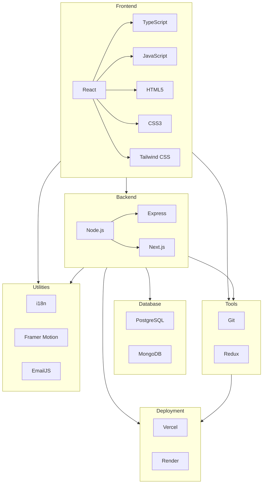

    

    <b>Automatic Architecture Diagrams from Code</b> 
    <a href="https://github.com/swark-io/swark">GitHub</a> • <a href="https://swark.io">Website</a> • <a href="mailto:contact@swark.io">Contact Us</a>

## Usage Instructions

1. **Render the Diagram**: Use the links below to open it in Mermaid Live Editor, or install the [Mermaid Support](https://marketplace.visualstudio.com/items?itemName=bierner.markdown-mermaid) extension.
2. **Recommended Model**: If available for you, use `claude-3.5-sonnet` [language model](vscode://settings/swark.languageModel). It can process more files and generates better diagrams.
3. **Iterate for Best Results**: Language models are non-deterministic. Generate the diagram multiple times and choose the best result.

## Generated Content
**Model**: GPT-4o - [Change Model](vscode://settings/swark.languageModel)  
**Mermaid Live Editor**: [View](https://mermaid.live/view#pako:eNqFUl1PwjAU_StNn8HEGBOzBxNhfIgMgU1fOh7KehnVrV3aTiGE_27ZB24G4lt7zr2n95zbA44kA-zgUMSKZlsUuKFASOfr8jpUUhgQ7AQi9ESWQCOzQt3uI-qRYJ-BHymemVXFF0SfTOgXvUC4ZBx40_sWNiB9379rQUMSUJ58c8GQ5QqqmKA1WI9Gn-e5RmRmXdx86HKyMRnsMgVaV7KjAn0mM9iZU9FlRZcauqYayp4JmUttYgX-YlrJvBBPili6vSsCgZSJLkunZMRr754NjeW7a69Clsh9CsKU1TPyDiqCpGp-tc2CgbrS_WZ4wg2H6tk54bcPompdkKGiKSjkScNljS7JILXpTv7kWu-53OxvttWxXF8joBbestBSOkfSrD-DxeE_iZbFpkyDwB1sjVpfzP7kQ4jNFlIIsYNCzGBD88SE-GiL8oxRAy6nNr0UO0bl0ME0N9Lfi6i-K5nHW-xsaKLh-AMWyQNT) | [Edit](https://mermaid.live/edit#pako:eNqFUl1PwjAU_StNn8HEGBOzBxNhfIgMgU1fOh7KehnVrV3aTiGE_27ZB24G4lt7zr2n95zbA44kA-zgUMSKZlsUuKFASOfr8jpUUhgQ7AQi9ESWQCOzQt3uI-qRYJ-BHymemVXFF0SfTOgXvUC4ZBx40_sWNiB9379rQUMSUJ58c8GQ5QqqmKA1WI9Gn-e5RmRmXdx86HKyMRnsMgVaV7KjAn0mM9iZU9FlRZcauqYayp4JmUttYgX-YlrJvBBPili6vSsCgZSJLkunZMRr754NjeW7a69Clsh9CsKU1TPyDiqCpGp-tc2CgbrS_WZ4wg2H6tk54bcPompdkKGiKSjkScNljS7JILXpTv7kWu-53OxvttWxXF8joBbestBSOkfSrD-DxeE_iZbFpkyDwB1sjVpfzP7kQ4jNFlIIsYNCzGBD88SE-GiL8oxRAy6nNr0UO0bl0ME0N9Lfi6i-K5nHW-xsaKLh-AMWyQNT)

